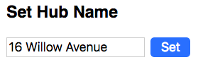

## Mutations

Your task now is to create a `<SetHubName />` component.
This should allow the user to set the hub's name:

To do this:

1. Verify that you can issue a mutation to set your hub's name in _GraphiQL_.

2. Create a simple `<SetHubName />` component that renders a `
` containing an `<input>` and a `<button>`. Test that it renders.

3. Now add event handlers to ensure that the input state gets saved locally, and the "Set" button can invoke a method when clicked.

4. Use the Apollo documentation to issue a mutation when the "Set" button is clicked.
